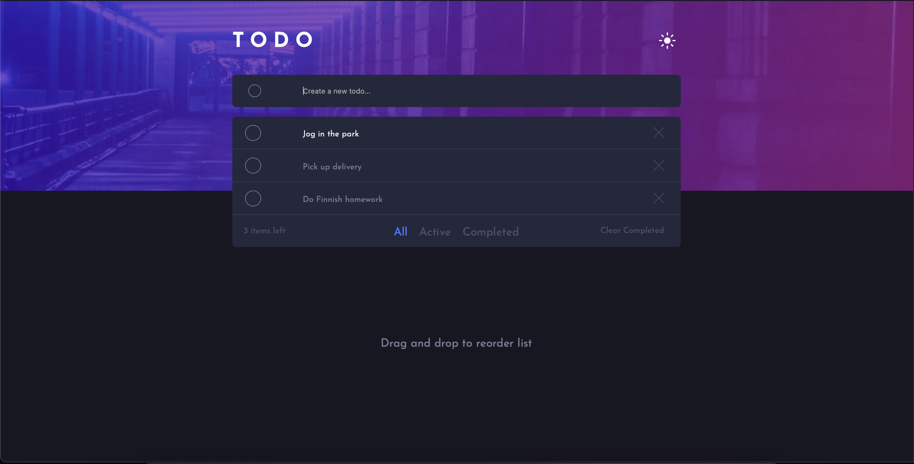

# Frontend Mentor - Todo app solution

This is a solution to the [Todo app challenge on Frontend Mentor](https://www.frontendmentor.io/challenges/todo-app-Su1_KokOW). Frontend Mentor challenges help you improve your coding skills by building realistic projects.

## Table of contents

- [Overview](#overview)
  - [The challenge](#the-challenge)
  - [Screenshot](#screenshot)
  - [Links](#links)
- [My process](#my-process)
  - [Built with](#built-with)
  - [What I learned](#what-i-learned)
  - [Continued development](#continued-development)
  - [Useful resources](#useful-resources)
- [Author](#author)
- [Acknowledgments](#acknowledgments)

## Overview

### The challenge

Users should be able to:

- View the optimal layout for the app depending on their device's screen size
- See hover states for all interactive elements on the page
- Add new todos to the list
- Mark todos as complete
- Delete todos from the list
- Filter by all/active/complete todos
- Clear all completed todos
- Toggle light and dark mode
- **Bonus**: Drag and drop to reorder items on the list

### Screenshot

### Links

- Solution URL: [Github Repository](https://github.com/Barbelitos/FrontEndMentor-ToDoApp)
- Live Site URL: [Live Site](https://barbelitos.github.io/FrontEndMentor-ToDoApp/)

## My process

### Built with

- HTML5
- CSS
- Mobile-first workflow
- [SortableJS](https://www.npmjs.com/package/sortablejs)
- [Next.js](https://nextjs.org/) - React framework
- [Styled Components](https://styled-components.com/) - For styles

### What I learned

This challenge helped me to learn more about JavaScript, and how to use it to handle the DOM.

### Continued development

### Useful resources

## Author

- GitHub - [Barbelitos](https://github.com/Barbelitos)
- Frontend Mentor - [@Barbelitos](https://www.frontendmentor.io/profile/Barbelitos)

## Acknowledgments
